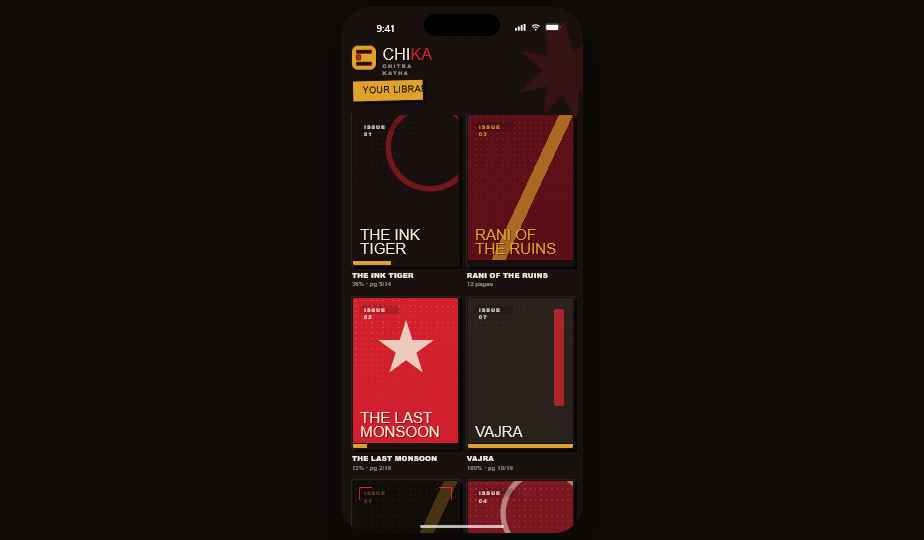
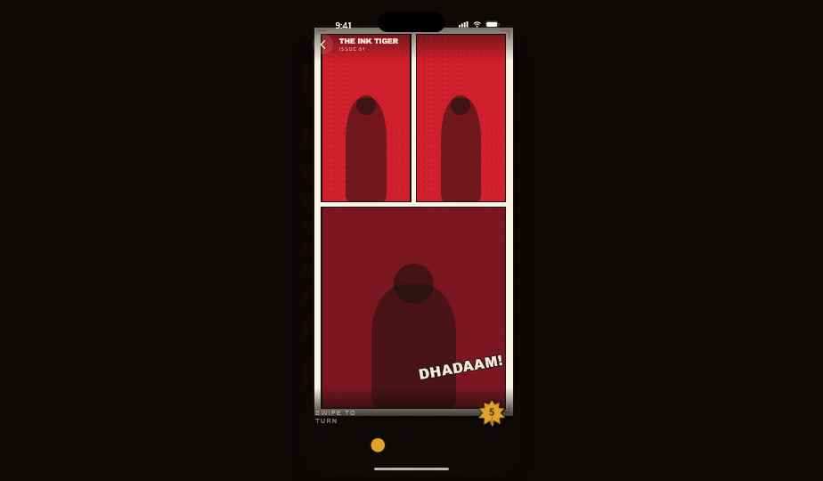

<p align="center">
  
</p>

<p align="center">
  <strong>Chika</strong> — a panel-by-panel comic reader for Android.<br>
  Open a CBZ/CBR, and Chika finds the panels with an on-device ML model and guides you through them
  one tap at a time.
</p>

<p align="center">
  <a href="https://github.com/batunii/chika/actions/workflows/ci.yml"></a>
  <a href="LICENSE"></a>
  
</p>

<p align="center">
  
  &nbsp;&nbsp;
  
</p>

---

## What it does

Tapping the right side of a page steps you **into each panel** in reading order — page → panel 1 →
panel 2 → … → zoom back out → next page — so a comic reads comfortably on a phone instead of
pinch-zooming around a full page. Panels are detected automatically; you can pan a zoomed panel,
swipe to turn whole pages, scrub pages, and flip reading direction (LTR/RTL).

## Features

- **CBZ and CBR** support, including **RAR5** (via 7-Zip-JBinding).
- **On-device ML panel detection** — a small YOLO TFLite model (Manga109-trained) finds panels and
  speech balloons; no network, fully offline.
- **Merge / divide planner** — groups tiny adjacent panels into one comfortable zoom and splits
  oversized panels with a bubble-aware cut.
- **Reader controls** — tap zones to step panels, swipe to turn pages, pinch + drag to pan
  (clamped to the artwork), a page scrubber, a "show whole page" button, and an LTR/RTL toggle.
- **Library** — import via the system file picker (copied into app storage), cover thumbnails,
  per-comic resume (page **and** panel), long-press to remove.
- **Chika brand UI** — pulp-comic identity (Anton + Archivo type, ink/crimson/cream/ochre palette).

## Build & run

Requires **Android Studio** (bundles JDK + SDK). Developed against JDK 21 and Android **API 36**;
`minSdk 26` (Android 8.0).

```bash
# build a debug APK
./gradlew :app:assembleDebug
# build and install on a connected device/emulator
./gradlew :app:installDebug
```

On Windows without `java` on PATH, point Gradle at Android Studio's bundled JDK first:

```powershell
$env:JAVA_HOME = "C:\Program Files\Android\Android Studio\jbr"
.\gradlew.bat :app:installDebug
```

CI builds the debug APK on every push/PR — see [`.github/workflows/ci.yml`](.github/workflows/ci.yml).

## How panel detection works

1. The page is letterboxed to 640×640 and run through the bundled TFLite model, which returns panel
   and text-balloon boxes.
2. Overlapping/duplicate boxes are suppressed; panels are ordered (rows top→down, LTR/RTL within a
   row).
3. The **planner** merges runs of small adjacent panels (capped for readability) and divides
   oversized panels with a single cut placed between bubble groups.
4. If the model finds nothing on a page, the reader falls back to showing the whole page.

## Architecture

The platform-independent core lives in `:shared`, a Kotlin Multiplatform module (JVM + iOS
targets) that `:app` consumes; it is the foundation for a future iOS app.

```
:shared (commonMain — pure Kotlin, unit-tested)
  data/archive   ComicArchive interface · image-entry filter · natural page ordering
  detection      Panel model · PanelOrdering (reading order) · PanelPlanner (merge/divide)
  ui/reader      camera math — panel framing (contain fit) + camera lerp

:app (Android)
  data/archive   ZipComicArchive (CBZ), RarComicArchive (CBR/RAR5 via 7-Zip-JBinding)
  data/page      PageLoader — downsampling decode + LRU bitmap cache
  data/db        Room (ComicEntity / dao / db)
  data/library   LibraryRepository — import (copy + cover), list, progress, delete
  detection      MlPanelDetector (TFLite) · whole-page fallback
  ui/reader      ReaderViewModel (page→panel state machine) + ReaderScreen (camera, gestures, chrome)
  ui/library     LibraryViewModel + LibraryScreen
  ui/brand       Chika component kit (mark, reticle, halftone, starburst, page coin, wordmark)
  ui/theme       palette + Anton/Archivo typography
```

**Stack:** Kotlin · Jetpack Compose (Material 3) · Coroutines · Room · TensorFlow Lite ·
Apache Commons Compress · 7-Zip-JBinding.

## License

Chika's source is licensed under the **Mozilla Public License 2.0** — see [`LICENSE`](LICENSE).

Third-party libraries, the bundled model, fonts, and brand assets keep their own licenses; the full
audit and obligations (including the **LGPL** 7-Zip component and **Manga109-s** model-data
disclosure) are in [`THIRD_PARTY_NOTICES.md`](THIRD_PARTY_NOTICES.md). The **Chika / Chitra Katha**
name, logo, and brand assets are owned by Chakra (Chalchitra Krida) and are not covered by the code
license.

## Acknowledgements

- Panel-detection model: [`leoxs22/manga-panel-detector-yolo26n`](https://huggingface.co/leoxs22/manga-panel-detector-yolo26n) (Apache-2.0), trained on Manga109-s.
- Fonts: **Anton** and **Archivo** (SIL Open Font License 1.1).
- **TensorFlow Lite**, **Apache Commons Compress**, **7-Zip-JBinding-4Android**.
